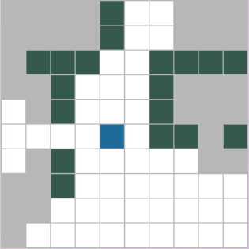
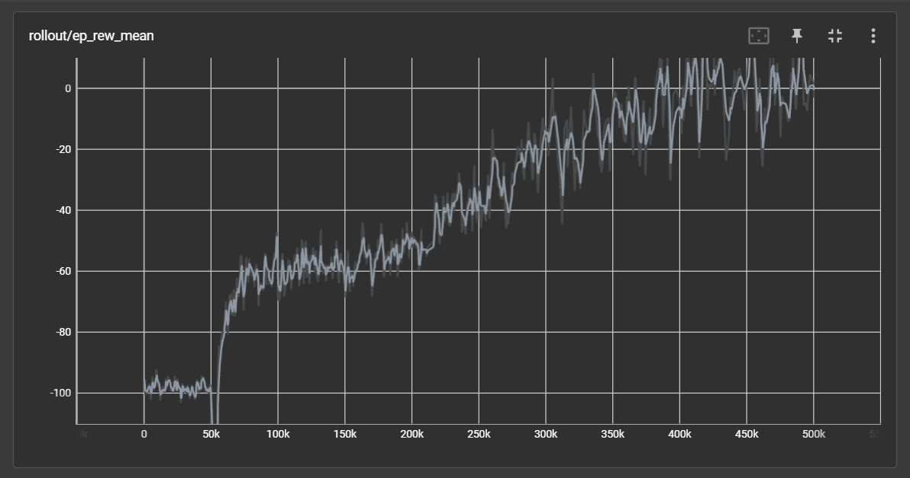
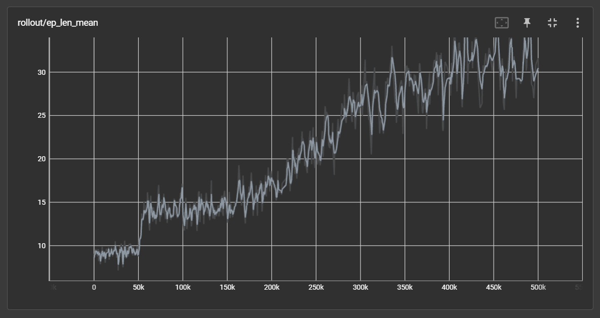
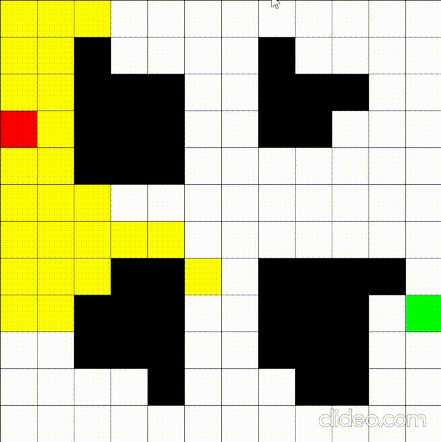

# Hide & Seek with Deep Q-Learning


This projects aim to use a DQN to build an AI agent that plays hide and seek with a player.

## Rules of the game
- The AI agent plays the role of the **Hider**, and the player the role of the **Seeker**.
- At the begining of the game, both the seeker and the hider will be placed randomly in the map (the hider will be initially placed outside the vision of the seeker).
-  The hider has as goal to stay hidden, as the seeker walks around the map trying to find it.
- The game ends when the hider gets caught (be within the vision of the seeker).

## Installation
To install the required packages, run the following command :
```bash
pip install -r requirements.txt
```

## Usage
To run the game, run the following command 
```bash
python play.py --model_name best_model
```

To train the model, run the following command 
```
python train.py [--map_path MAP_PATH] [--map_names MAP_NAME1 MAP_NAME2 MAP_NAME3 ...] 
                      [--grid_size GRID_SIZE] [--max_steps MAX_STEPS] [--vision_range VISION_RANGE]
                      [--use_cache USE_CACHE] [--lr LR] [--exp EXP] [--log_dir LOG_DIR]
                      [--timesteps TIMESTEPS] [--progress_bar PROGRESS_BAR] [--save_model SAVE_MODEL]
                      [--model_dir MODEL_DIR] [--model_name MODEL_NAME] [--prob_optimal_move PROB]

optional arguments:
  --map_path MAP_PATH       path to the maps JSON file (default: maps.json)
  --map_names MAP_NAMES      name of all the maps to use (default: default map1 map2 map3 map4)
  --vision_range VISION_RANGE vision range of the agent (default: 5)
  --grid_size GRID_SIZE     grid size of the map (default: 12)
  --max_steps MAX_STEPS     maximum number of steps in each episode (default: 300)
  --use_cache USE_CACHE     whether to use caching (default: True)
  --lr LR                   learning rate (default: 1e-4)
  --exp EXP                 exploration rate (default: 0.1)
  --log_dir LOG_DIR         directory to save logs (default: logs)
  --timesteps TIMESTEPS     total timesteps for training (default: 500_000)
  --progress_bar PROGRESS_BAR show progress bar during training (default: True)
  --save_model SAVE_MODEL   whether to save the trained model (default: True)
  --model_dir MODEL_DIR     directory to save trained models (default: models)
  --model_name MODEL_NAME   name to give to the model (default: None)
  --prob_optimal_move PROB  probability of the seeker taking the optimal move (default: 0.60)
```

Note that the default parameters are the ones used to train the [best model](models/best_model)

## How to play

### Controls
- **z :** move up
- **s :** move down
- **q :** move left
- **d :** move right
- **ESC :** quit the game

### Game UI
- **Red cell :** the seeker (You)
- **Green cell :** the hider (AI agent)
- **Yellow cell :** the visible cells by the seeker
- **Black cell :** the wall cells
- **White cell :** the hidden cells


## Training the AI agent with RL

### Observation space
The observation space is defined by the following variables :
- **Seeker position :** the position of the seeker in the map.
- **Hider position :** the position of the hider in the map.
- **wall cells :** the cells that are occupied by a wall.
- **visible cells :** the cells that are visible by the seeker.

An observation is represented by a 2D array of shape (grid_size*grid_size, 1) where each cell contains a value between 0 and 4 corresponding to either the seeker, the hider, a wall cell, a visible cell, or a hidden cell.


### Action space
There are four possible actions that the agent can take :
- **Move up**
- **Move down**
- **Move left**
- **Move right**

### Reward system
There are three different rewards that were :
1. **Loosing :** the agent gets a negative reward if it gets caught by the seeker. This reward was set to -100.
2. **Hitting the wall:** the agent gets a negative reward if it hits a wall. This allows the agent to learn to navigate the map. This reward was set to -10.
3. **Distance :** the agent gets a positive reward to incentives it to maximize its distance from the field of view of the player. The value of this reward was set to the distance between the agent and the closest visible cell.

### Training Strategy

#### Player movements
To train the agent to hide from the player, we need to make the player move and search for the agent during the training. However, we don't want to build another AI agent to play the role of the seeker during the training, because this will add on the complexity of this project and isn't really needed to acheive our goal. Instead, we will use a path finding algorithem Dijkstra to compute the optimal moves for the seeker to find the agent. 

During the training, the seeker will flip a biased coin with a probability of **0.60** to decide whether to follow the optimal moves or to take a random valid action. Alternating between the optimal moves and random actions allows us to some degree to simulate a real player that sometimes might have random unexpected actions.

Note that the agent will make its decision based on the state of the game previous to the seeker's move. This is done to simulate both seeker and hider moving at the same time and to make the game more fair and realistic since the hider shouldn't know seeker's future move.

#### Map choice
To make the agent more robust, we will train it on different maps. This will allow the agent to learn to hide in different environments and to generalize better. All maps are defined in the [maps.json](src/maps.json) file. When training the agent, we provide it with a list of maps to train on. The agent will then randomly choose a map from this list at the begining of each episode.

<!-- Training Strategy -->


## Implementation details

### Optimal moves 
Seeker optimal moves are computed using a **Dijkstra** algorithm to find the shortest path between the seeker and hider position. This was implemented using the
[Path-Finding](https://pypi.org/project/pathfinding/) package.

### Player vision
**Bresenham's** algorith was used to compute the visible cells by the player.For more on its implmeentation, see [vision.py](src/utils/vision.py). Here is an example of the field of view :




### Caching
To make computation more efficient during the training, the optimal moves and visible cells are cached to be reused later. This allows us to avoid recomputing the optimal moves and visible cells at each step of the game. This caching system is handled by the map handler class [MapHandler](src/handlers/map_handler.py) since the optimal moves and visible cells are map dependent.

## Results

### Training curves

Average reward over 500k episodes.

<!-- control the size of the plots -->


Average episode length over 500k episodes.


### Demo




